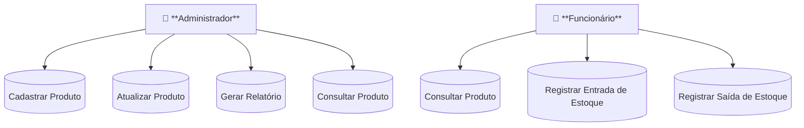
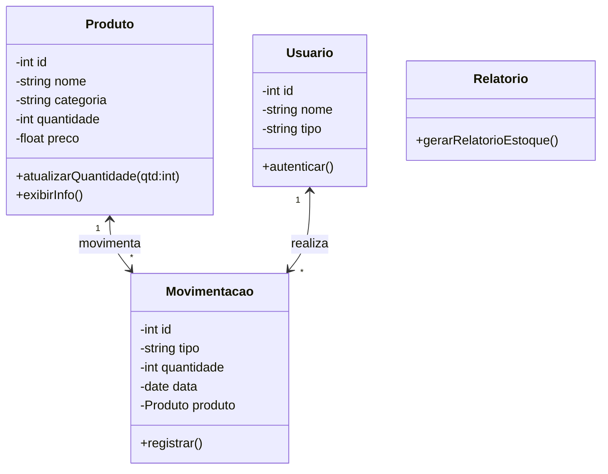

# 🏷️ Sistema de Controle de Estoque

## 📘 Contexto
Este projeto tem como objetivo desenvolver um **sistema de controle de estoque** simples, executado pelo terminal, com persistência em banco de dados PostgreSQL.

## 👥 Atores
- **Administrador:** gerencia produtos e usuários.
- **Funcionário:** registra movimentações e consulta produtos.

## ⚙️ Funcionalidades principais
1. Cadastrar produto  
2. Consultar produto  
3. Atualizar produto  
4. Registrar entrada de estoque  
5. Registrar saída de estoque  
6. Gerar relatório de estoque  

## 🧩 Diagramas
### Casos de Uso

### Classes

## 🧱 Protótipo
O sistema é operado por menu de terminal:

📄 [Visualizar Protótipo em PDF](./desing/Prototipo.pdf)

## 💻 Tecnologias utilizadas
- 
-   
-  

## 🚀 Execução
1. 
2. 
