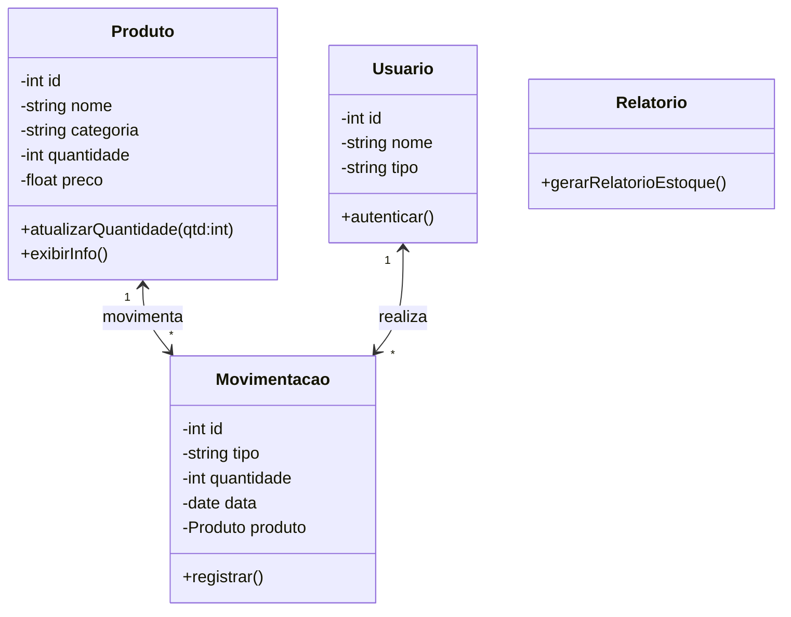

# 🏷️ Sistema de Controle de Estoque

## 📘 Contexto
Este projeto tem como objetivo desenvolver um **sistema de controle de estoque** simples, executado pelo terminal, com persistência em banco de dados PostgreSQL.

## 👥 Atores
- **Administrador:** gerencia produtos e usuários.
- **Funcionário:** registra movimentações e consulta produtos.

## ⚙️ Funcionalidades principais
1. Cadastrar produto  
2. Consultar produto  
3. Atualizar produto  
4. Registrar entrada de estoque  
5. Registrar saída de estoque  
6. Gerar relatório de estoque  

## 🧩 Diagramas
### Casos de Uso
```mermaid
usecaseDiagram
actor Administrador
actor Funcionário

Administrador --> (Cadastrar Produto)
Administrador --> (Atualizar Produto)
Administrador --> (Gerar Relatório)
Administrador --> (Consultar Produto)

Funcionário --> (Consultar Produto)
Funcionário --> (Registrar Entrada de Estoque)
Funcionário --> (Registrar Saída de Estoque)
```

### Classes


## 🧱 Protótipo
O sistema é operado por menu de terminal:
```
==== SISTEMA DE CONTROLE DE ESTOQUE ====
1 - Cadastrar Produto
2 - Consultar Produto
3 - Atualizar Produto
4 - Registrar Entrada
5 - Registrar Saída
6 - Gerar Relatório
0 - Sair
```

## 💻 Tecnologias utilizadas
- 
-   
-  

## 🚀 Execução
1. 
2. 
